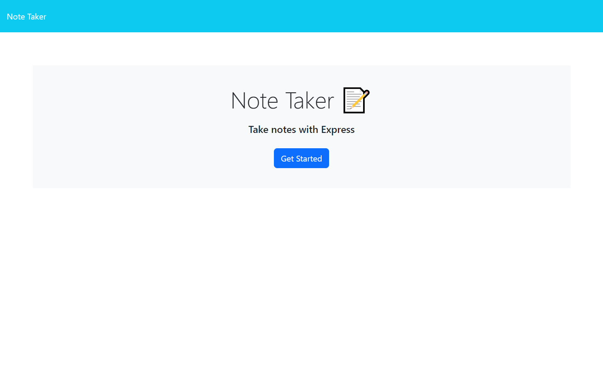

  
# Note Taker App
## Description
This application allows users to store notes. Saved notes will appear along the left-hand side bar, where users can click back into a specific note for extra details. Users can also delete notes if they are no longer needed.
## Table of Contents
[Installation](#installation)  
[Usage](#usage)  
[License](#license)  
[Constributing](#contributing)  
[Tests](#tests)  
[Questions](#questions)
## Installation
Run the 'npm install' command to install everything required to run this app. This includes express, path, fs, and util.
## Usage
Use this application to keep track of notes. Click the 'Get Started' button to begin.  
Deployed app: [Note-taker-app](https://note-taker-mtstall.herokuapp.com/)

## License
This application is covered under the MIT license.
## Contributing
Fork the code to contribute!
## Tests
N/A
## Questions
GitHub profile: [mtstall](https://www.github.com/mtstall)    
Email address: mtstallings95@gmail.com  
Please email me to reach me with additional questions.